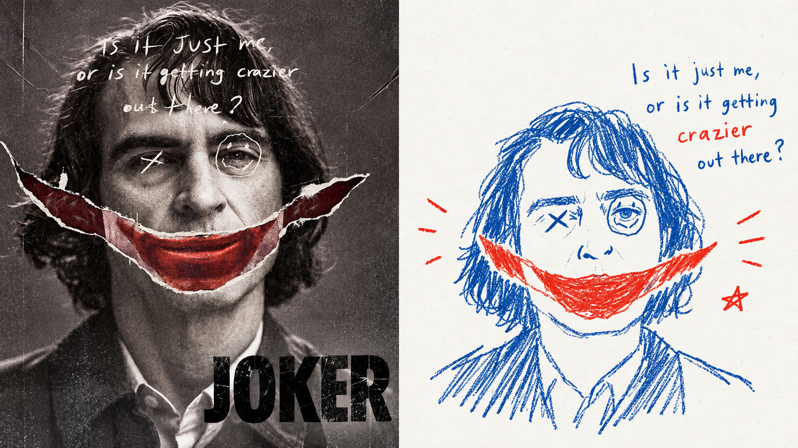
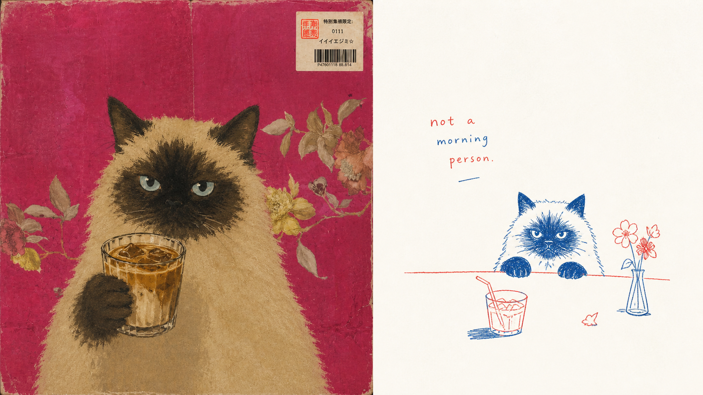
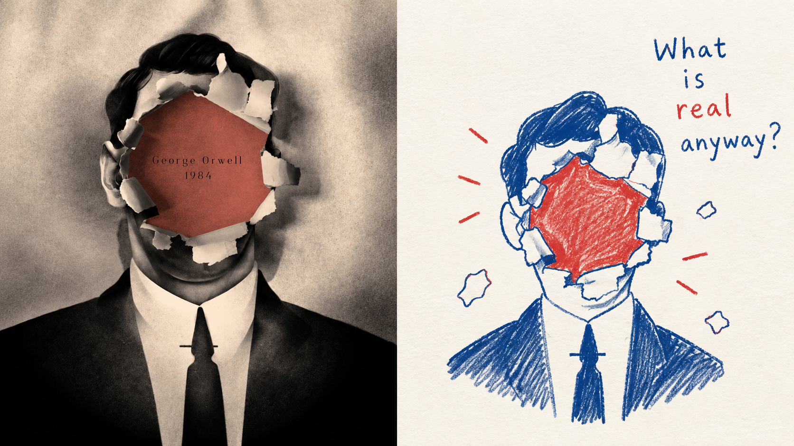
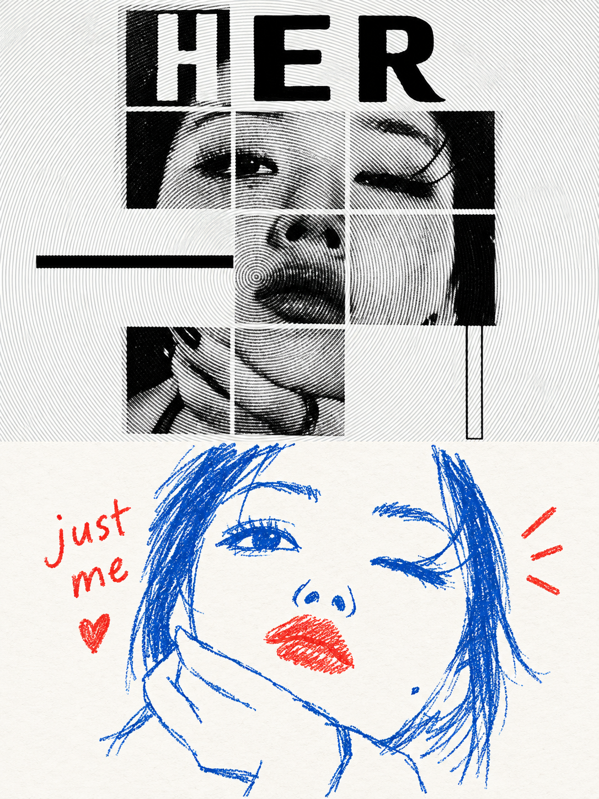
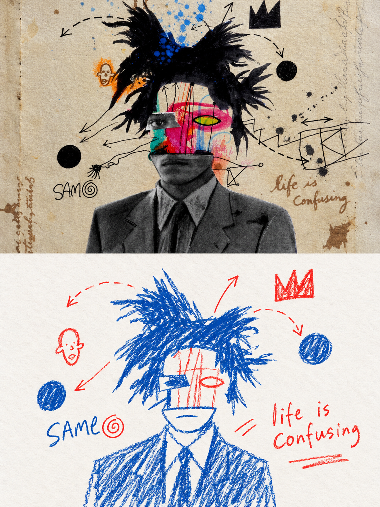
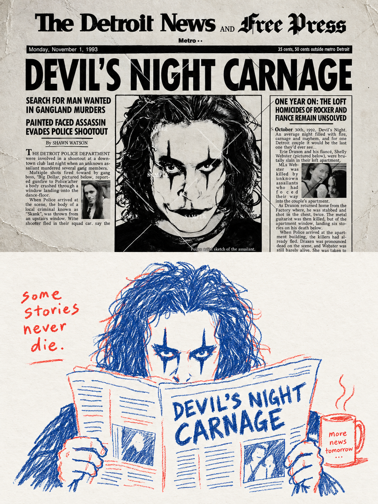
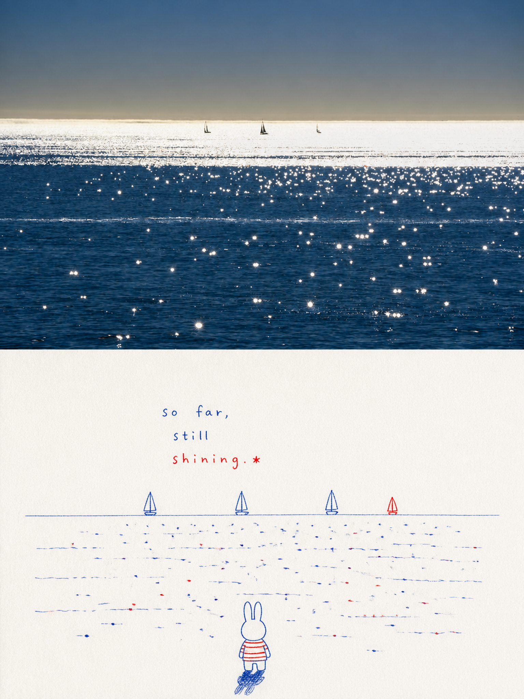

# 🦁 XXD Panel 067

### 고정된 빨간색과 파란색 잉크를 사용하여 유머러스하고 온화한 일상의 관찰을 기록하세요.

<a href="README.md">简体中文</a> · <a href="README.en.md">English</a> · <a href="README.ja.md">日本語</a> · <a href="README.ko.md">한국어</a> · <a href="README.ar.md">العربية</a>

Panel 067는 빨간색과 파란색의 두 가지 손으로 그린 잉크만 사용하여 매우 가벼운 종이에 손 오류가 있는 비뚤어지고 간헐적인 선으로 핵심 장면을 다시 말하므로 그림이 세심하게 디자인된 개인 관찰 메모처럼 보입니다.

**키워드:** 빨간색과 파란색 고정 · 손으로 그린 이중 잉크 · 사적인 관찰 · 어린애 같은 유머 · 넓은 여백

## 사용

```text
/xxd-panel-067 photo.jpg --mode design-only --size 3:4 --text prompt --locale ko-KR
```

단일 이미지, 디렉터리 배치, 4가지 출력 모드, 다양한 크기 및 3가지 텍스트 모드를 지원합니다. 전체 동작은 [SKILL.md](SKILL.md)를 참조하세요.

## 원본 프롬프트 · 5개 언어

[통합 다국어 카탈로그](references/original-prompt/) 열기: [중국어 간체 원본](references/original-prompt/zh-CN.md) · [영어](references/original-prompt/en.md) · [일본어](references/original-prompt/ja.md) · [한국어](references/original-prompt/ko.md) · [العربية](references/original-prompt/ar.md)

중국어 간체 파일은 사용자가 제공한 원본 텍스트를 그대로 저장하며 런타임 시 유일한 창의적이고 미적인 권위입니다. 다른 네 가지 버전은 충실한 읽기 번역으로, 해외 독자가 이해하고 전달할 수 있도록 편리하며 그림에 대한 프롬프트 단어를 다시 쓰지 않습니다.

원본 X 증명이나 출처는 현재 사용할 수 없으므로 `sample-01`–`04`는 유지됩니다. 아래에 새로 추가된 샘플은 모두 명확한 콘텐츠 소스 매핑을 가지고 있습니다. 자세한 내용은 [샘플 목록](assets/examples/README.md)를 참조하세요.

## 16:9 좌우 이중교정 추가

| | |
|---|---|
|  |  |
|  |  |

## 3:4 상하 이중교정 추가

| | |
|---|---|
|  |  |
|  |  |
